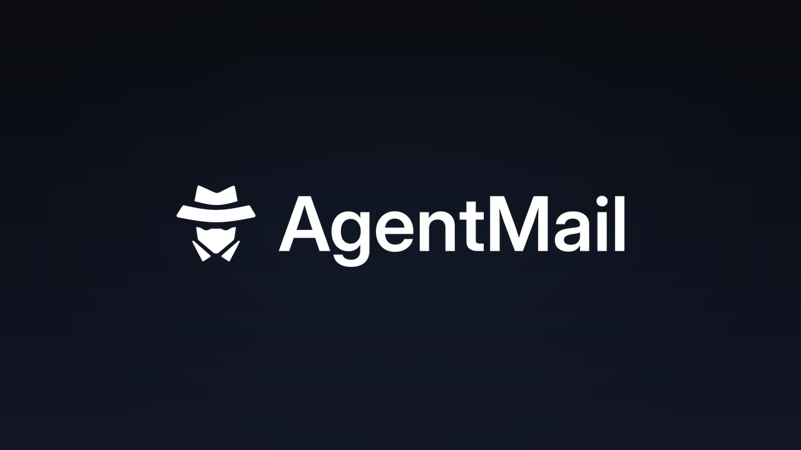

# AgentMail Agent — an AI agent you talk to by email

**Run with [Orgo](https://orgo.ai) · Powered by [AgentMail](https://agentmail.to)**

A persistent AI agent whose front door is its own email inbox, running on its
own cloud computer. Email it anything — a question, "summarize this", "look
this up" — and it reads the message, does the work (it has a real Linux
desktop: terminal, Chrome, files), and replies in-thread in seconds.

No webhooks to configure, no server to host, no infra. The inbox is created
for you at first boot, and a supervised **AgentMail WebSocket listener**
(outbound-only, no public endpoint) triggers the responder the moment
`message.received` fires — with a 5-minute poller as the automatic fallback
whenever the socket is down.



## What you need

| | |
|---|---|
| **AgentMail API key** (`am_…`) | [console.agentmail.to](https://console.agentmail.to) — the one key this template needs |
| **Nous account** | free sign-in during setup powers the model (gpt-5.5) — no model API key |
| **Orgo account** | [orgo.ai](https://orgo.ai) — publishing templates needs a Scale plan |
| Composio key (`ck_…`), optional | [app.composio.dev](https://app.composio.dev) — gives the agent 1000+ app tools |

No secrets are baked anywhere in this repo or in the built template.

## Quick start

```bash
git clone https://github.com/nickvasilescu/agentmail-agent
cd agentmail-agent
pip install jsonschema pyyaml   # for local validation

# 1) assemble + validate
python3 build_template.py

# 2) publish + build on your Orgo account (streams build events to "ready")
export ORGO_API_KEY=sk_live_...
python3 build_template.py --build

# 3) launch a computer from it
curl -X POST https://www.orgo.ai/api/computers \
  -H "Authorization: Bearer $ORGO_API_KEY" -H "Content-Type: application/json" \
  -d '{"workspace_id":"<WS_ID>","name":"my-email-agent","template_ref":"default/agentmail-agent@0.2.3"}'
```

Open the computer's desktop and a guided **2-step setup** is already waiting:

1. **Connect Nous** — a device-code sign-in (open the link, enter the code).
2. **Paste your AgentMail key** — the setup creates your agent's inbox,
   seeds the responder, and prints your agent's email address:

```
📬  your-agent@agentmail.to
```

Email it. Replies land in seconds — work included.

> Tip: set `agentmail_api_key` in your Orgo workspace vault before launching
> and step 2 happens automatically. Or bake your own keyed build —
> `AGENTMAIL_BAKE_KEY=am_… python3 build_template.py --build` — and the inbox
> is created at launch with zero touches (setup becomes the Nous sign-in
> only). `AGENTMAIL_BAKE_MODEL=<model>` likewise pins a different Nous model
> everywhere (handy if your Nous account has no paid credits).

## What's inside

- **Hermes runtime** ([hermes-agent](https://hermes-agent.nousresearch.com),
  gpt-5.5 via Nous OAuth), supervised and reboot-safe, dormant until setup.
- **AgentMail MCP** (`mcp.agentmail.to`) — full inbox/thread/draft/label
  tools for the agent, enabled the moment your key exists.
- **Idempotent inbox bootstrap** — created with a per-launch `client_id`
  (minted at first boot, never baked into the golden); never adopts an inbox
  it didn't create.
- **WebSocket-first responder** — a supervised listener holds a persistent
  AgentMail WebSocket subscription and triggers a responder pass the moment
  your email arrives (validated: event in ~1s, in-thread reply in ~12s). A
  5-minute cron poller takes over automatically when the socket is down, and
  a catch-up pass on every reconnect sweeps anything that arrived meanwhile.
- **Deterministic core** — one shared module does everything mechanical
  (poll, locked dedupe ledger, claims, guard rails, sending); the LLM only
  decides what to say. Guards: never answers backlog, never answers mail
  older than 48h, max 3 replies/pass, flood → re-initialize, and the
  listener and poller can never double-reply to the same message.
- **Self-healing** — a supervised watchdog restarts a wedged scheduler AND a
  stale listener; every service runs under an exclusive lock (and
  self-replaces on restart) so duplicate spawns can never fight.
- **Optional Composio MCP** — add `COMPOSIO_CONSUMER_KEY=ck_…` to
  `~/.hermes/.env` (or just email your agent the key and ask it to wire
  itself up).

## Repo layout

```
agentmail-agent.orgo.yaml   # the whole template as one readable document
build_template.py           # assemble → validate → publish → build → launch
make_wallpaper.py           # regenerates files/wallpaper.jpg (pure PIL)
assets/                     # official AgentMail brand assets (see SOURCES.md)
files/                      # everything baked into the VM
├── config.yaml             #   Hermes config (model, MCP servers)
├── SOUL.md                 #   the agent's email-native persona
├── onboard.sh              #   the 2-step desktop setup
├── bootstrap-inbox.py      #   idempotent inbox creation (per-launch identity)
├── inbox_core.py           #   shared deterministic core: ledger+claims+heartbeat
├── inbox-listener.py       #   WebSocket listener → instant responder passes
├── listener-run.sh         #   supervised listener wrapper (locked, self-replacing)
├── seed-inbox-cron.py      #   seeds/migrates the 5-minute fallback poller
├── inbox-helper.py         #   thin CLI over the core (poll/reply/mark)
├── sync-mcp.py             #   enables MCP servers only when keys exist
├── watchdog.sh             #   un-wedges a stuck scheduler or stale listener
├── gateway-run.sh          #   supervised gateway wrapper (locked, gated)
└── skills/agentmail-inbox/ #   the agent's guide to its own inbox
```

`build_template.py` and `agentmail-agent.orgo.yaml` contain the same
template — the script is the source of truth (it inlines `files/` byte-for-
byte); the YAML is generated from it for easy reading.

## Battle-tested

Validated end-to-end on live VMs (July 2026): build → boot → onboard →
email in → WebSocket event in ~1 second → agent does the work → in-thread
reply in ~12 seconds, fully autonomous. Drilled beyond the happy path:
fallback (listener down → poller answers in ≤6 min, no duplicates), watchdog
(frozen listener auto-restarted), and restart/reconnect catch-up. Every
guard rail above exists because a real test — or a real user's launch —
broke something first; details in the commit history.

## License

MIT
